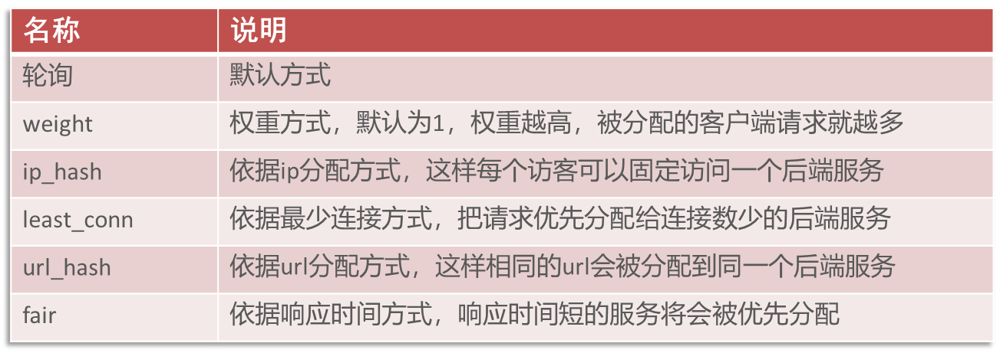
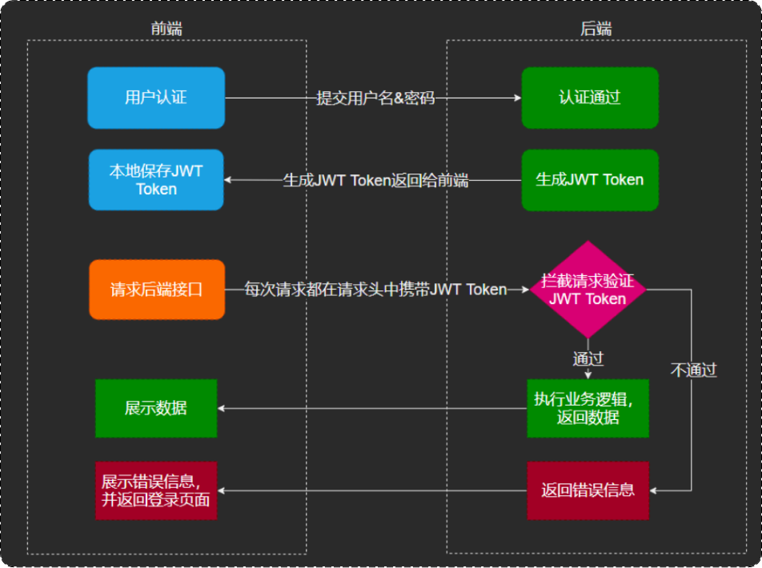
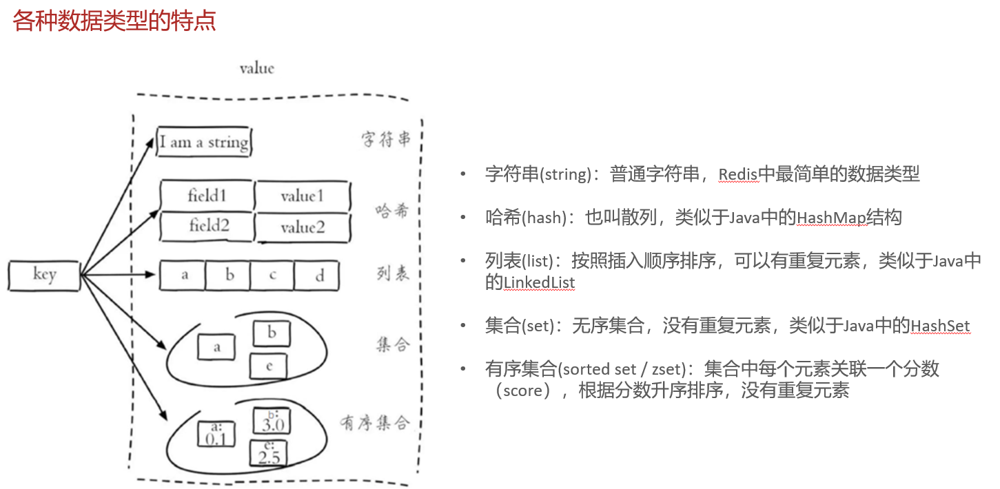
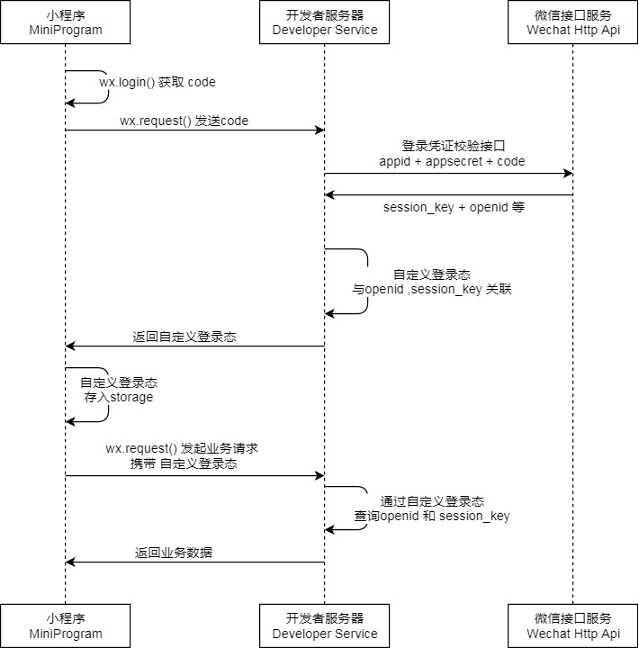

#### 后端环境搭建---nginx反向代理
将前端发送的动态请求由nginx转发到后端服务器：
* 前端请求到nginx服务器，再由nginx服务器转发到后端tomcat服务器
 

nginx反向代理好处：
1. 提高访问速度
2. 进行负载均衡(就是吧大量的请求按照我们指定的方式均衡的分配给集群中的每台服务器)
3. 保证后端服务安全
 
负载均衡策略:

##### 完善登陆功能
1. 修改数据库中明文密码，改为MD5加密后的密文
2. 修改Java代码，前端提交的密码进行MD5加密后再跟数据库中密码比对

##### JWT中获取id并在service中使用

需要用到ThreadLocal:
1. ThreadLocal并不是一个Thread，而是Thread的局部变量
2. ThreadLocal为每个线程提供单独一份存储空间，具有线程隔离的效果，只有在线程内才能获取到对应的值，线程外则不能访问
3. ThreadLocal常用方法:
   * public void set(T value) 设置当前线程的线程局部变量的值
   * public T get()   返回当前线程所对应的线程局部变量的值
   * public void remove()  移除当前线程的线程局部变量
   
##### 日期以数组的形式发送，展现时有问题的解决办法
1. 在属性上加入注解，对日期进行格式化
 
   @JsonFormat(pattern = "yyyy-MM-dd HH:mm:ss")
 
   private LocalDateTime updateTime;
2. 在WebMvcConfiguration中扩展Spring MVC的消息转换器，统一对日期类型进行格式化处理

##### 公共字段自动填充
1. 问题分析：如create_time、create_user...等属于业务表中的公共字段，每个业务都需要赋值，比较繁琐。造成代码冗余，不便于后期维护的问题
2. 实现思路：先看字段的操作类型，如create_time是insert时，update_user是insert与update时
3. 操作思路：统一处理，使用切面
   * 自定义注解AutoFill，用于标识需要进行公共字段自动填充的方法
   * 自定义切面类AutoFillAspect，统一拦截加入了AutoFill注解的方法，通过反射为公共字段赋值
   * 在Mapper的方法上加入AutoFill注解
   * 技术点：枚举、注解、AOP、反射

##### Redis
1. Redis入门:
   * 基于内存的key—value结构数据库
     * 基于内存存储，读写性能会更高
     * 适合存储热点数据(热点商品、资讯、新闻)
     * 企业应用广泛
   * 官网:
     * https://redis.io    
     * https://www.redis.net.cn/
   * Redis服务的启动与停止
     * 服务启动:在安装目录下进入命令行,输入:redis-server.exe redis.windows.conf
     * 服务停止:在安装目录下进入命令行,输入ctrl+C
     * 客户端启动:在安装目录下进入命令行,输入redis-cli.exe -h localhost -p 6379 -a password即可(也可以先进入，再输入auth password)
2. Redis数据类型(key-value结构，其中key是字符串类型，value有五种常用的数据类型)
   * 字符串 string
   * 哈希 hash
   * 列表 list
   * 集合 set
   * 有序集合 sorted set/zset
     

3. Redis常用命令
* 字符串操作命令
   
| 操作命令                   | 命令内涵                           | 
|------------------------|--------------------------------|
| SET key value          | 设置指定key的值                      |
| GET key                | 获取指定key的值                      |
| SETEX key seconds value | 设置指定key的值，并将key的过期时间设为seconds秒 |
| SETEX key value        | 只有在key不存在时设置key的值              |

  * 哈希操作命令
    * Redis hash是一个string类型的field和value的映射表，hash特别适合用于存储对象

| 操作命令                 | 命令内涵                      |
|----------------------|---------------------------|
| HSET key field value | 将哈希表key中的字段field的值设为value |
| HGET key field       | 获取存储在哈希表中指定字段的值           |
| HDEL key field       | 删除存储在哈希表中的指定字段            |
| HKEYS key            | 获取哈希表中所有字段                |
| HVALS key            | 获取哈希表中所有值                 |

* 列表操作命令
    * Redis列表是简单的字符串列表，按照插入顺序排序
  
| 操作命令                      | 命令内涵              |
|---------------------------|-------------------|
| LPUSH key value1 [value2] | 将一个或多个值插入到列表头部(左边) |
| LRANGE key start stop     | 获取列表指定范围内的元素      |
| RPOP key                  | 移除并获取列表最后一个元素(右边) |
| LLEN key                  | 获取列表长度            |

* 集合操作命令
Redis set是string类型的无序集合，集合成员是唯一的，集合中不能出现重复的数据

| 操作命令                       | 命令内涵        |
|----------------------------|-------------|
| SADD key member1 [member2] | 向集合添加一个或多个成员 |
| SMEMBERS key               | 返回集合中的所有成员  |
| SCARD key                  | 获取集合的成员数    |
| SINTER key1 [key2]         | 返回给定所有集合的交集 |
| SUNION key1 [key2]         | 返回所有给定集合的并集 |
| SREM key member1 [member2] | 删除集合中一个或多个成员 |

* 有序集合操作命令
    * Redis有序集合是string类型元素的集合，且不允许有重复成员。每个元素都会关联一个double类型的分数

| 操作命令                                     | 命令内涵                       |
|------------------------------------------|----------------------------|
| ZADD key score1 member1 [score2 member2] | 向有序集合添加一个或多个成员             |
| ZRANGE key start stop [WITHSCORES]       | 通过索引区间返回有序集合中指定区间内的成员      |
| ZINCRBY key increment member             | 有序集合中对指定成员的分数加上增量increment |
| ZREM key member                          | 移除有序集合中的一个或多个成员            |

* 通用命令
    * Redis的通用命令是不分数据类型的，都可以使用的命令

| 操作命令         | 命令内涵                    |
|--------------|-------------------------|
| KEYS pattern | 查找所有符合给定模式(pattern)的key |
| EXISTS key   | 检查给定key是否存在             |
| TYPE key     | 返回key所存储的值的类型           |
| DEL key      | 该命令用于在key存在是删除key       |

4. 在Java中操作Redis
    * Redis的Java客户端很多，常用的有:
      * Jedis:官方推荐
      * Lettuce:性能是否高效
      * Spring Data Redis:是Spring的一部分，对Redis底层开发包进行了高度封装
    * Spring Data Redis使用方式
      * 导入Spring Data Redis的maven坐标
      * 配置Redis数据源
      * 编写配置类，创建RedisTemplate对象
      * 通过RedisTemplate对象操作Redis
      
##### 微信小程序
1. HttpClient
    * 介绍：是Apache Jakarta Common下的子项目，可以用来提供高效的、最新的、功能丰富的
   支持HTTP协议的客户端编程工具包，并且支持HTTP协议最新的版本和建议
    * 核心API：
        * HttpClient
        * HttpClients
        * CloseableHtppClient
        * HttpGet
        * HttpPost
    * 发送请求步骤：
        * 创建HttpClient对象
        * 创建Http请求对象
        * 调用HttpClient的execute方法发送请求
2. 微信登陆

    * 说明
      * 调用 wx.login() 获取 临时登录凭证code ，并回传到开发者服务器。
      * 调用 auth.code2Session 接口，换取 用户唯一标识 OpenID 、 用户在微信开放平台账号下的唯一标识UnionID（若当前小程序已绑定到微信开放平台账号） 和 会话密钥 session_key。
      之后开发者服务器可以根据用户标识来生成自定义登录态，用于后续业务逻辑中前后端交互时识别用户身份。

    * 注意事项
      * 会话密钥 session_key 是对用户数据进行 加密签名 的密钥。为了应用自身的数据安全，开发者服务器不应该把会话密钥下发到小程序，也不应该对外提供这个密钥。
      * 临时登录凭证 code 只能使用一次

##### 缓存
用户端访问量比较大，数据库访问压力随之增大，需要通过Redis来缓存数据，减少数据库查询操作
* 需要注意缓存的粒度
* 数据库中数据有变更时需要清理缓存数据以保证数据的一致性
* 优化:Spring Cache:是一个框架，实现了基于注解的缓存功能。注意:Spring Cache提供了一层抽象，底层可以切换不同的缓存实现,例如:
    * EHCache
    * Caffeine
    * Redis
* Spring Cache常用注解：

| 注解             | 说明                                                          |
|----------------|-------------------------------------------------------------|
| @EnableCaching | 开启缓存注解功能，通常加在启动类上                                           |
| @Cacheable     | 在方法执行前先检查缓存中是否有数据，如果有数据，则直接返回缓存数据；如果没有缓存数据，调用方法并将方法返回值放到缓存中 |
| @CachePut      | 将方法的返回值放到缓存中                                                |
| @CacheEvict    | 将一条或多条数据从缓存中删除                                              |

##### spring EL 表达式

##### Spring Task定时任务
1. Spring Task是Spring框架的任务调度工具，可以按照约定的时间自动执行某个代码逻辑
2. corn表达式:是一个字符串，可以定义任务触发的时间
    * 分为6或7个域，由空格分开，每个域代表一个含义：秒  分钟  小时  日  月  周  年(可选)
    * corn表达式在线生成器： https://cron.qqe2.com/
3. Spring Task使用步骤:
    * 导入maven坐标spring-context
    * 启动类添加注解@EnableScheduling开启任务调度
    * 自定义定时任务类
   

