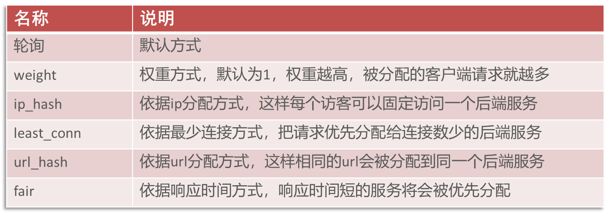
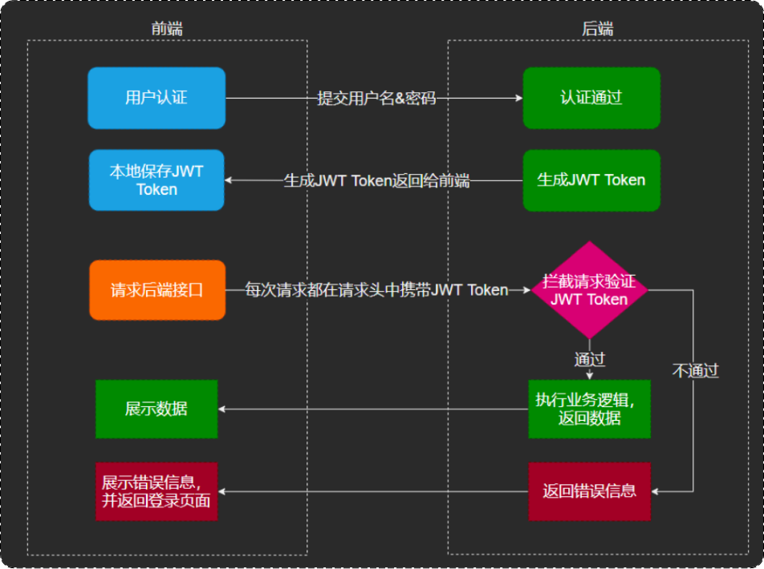

#### 后端环境搭建---nginx反向代理
将前端发送的动态请求由nginx转发到后端服务器：
* 前端请求到nginx服务器，再由nginx服务器转发到后端tomcat服务器
 

nginx反向代理好处：
1. 提高访问速度
2. 进行负载均衡(就是吧大量的请求按照我们指定的方式均衡的分配给集群中的每台服务器)
3. 保证后端服务安全
 
负载均衡策略:

##### 完善登陆功能
1. 修改数据库中明文密码，改为MD5加密后的密文
2. 修改Java代码，前端提交的密码进行MD5加密后再跟数据库中密码比对

##### JWT中获取id并在service中使用

需要用到ThreadLocal:
1. ThreadLocal并不是一个Thread，而是Thread的局部变量
2. ThreadLocal为每个线程提供单独一份存储空间，具有线程隔离的效果，只有在线程内才能获取到对应的值，线程外则不能访问
3. ThreadLocal常用方法:
  * public void set(T value) 设置当前线程的线程局部变量的值
  * public T get()   返回当前线程所对应的线程局部变量的值
  * public void remove()  移除当前线程的线程局部变量
##### 日期以数组的形式发送，展现时有问题的解决办法
1. 在属性上加入注解，对日期进行格式化
 
   @JsonFormat(pattern = "yyyy-MM-dd HH:mm:ss")
 
   private LocalDateTime updateTime;
2. 在WebMvcConfiguration中扩展Spring MVC的消息转换器，统一对日期类型进行格式化处理
##### 公共字段自动填充
1. 问题分析：如create_time、create_user...等属于业务表中的公共字段，每个业务都需要赋值，比较繁琐。造成代码冗余，不便于后期维护的问题
2. 实现思路：先看字段的操作类型，如create_time是insert时，update_user是insert与update时
3. 操作思路：统一处理，使用切面
* 自定义注解AutoFill，用于标识需要进行公共字段自动填充的方法
* 自定义切面类AutoFillAspect，统一拦截加入了AutoFill注解的方法，通过反射为公共字段赋值
* 在Mapper的方法上加入AutoFill注解
* 技术点：枚举、注解、AOP、反射